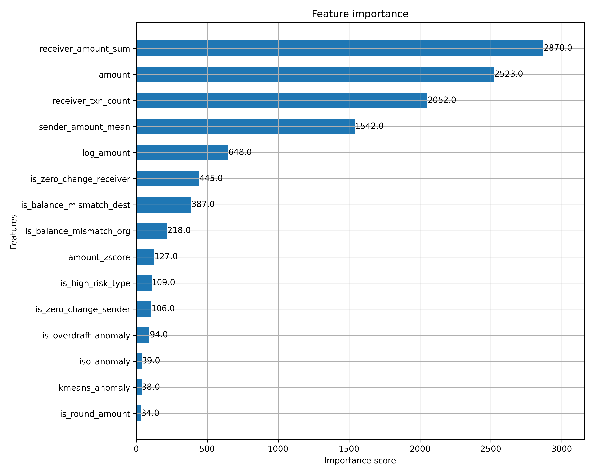

#  Financial Fraud Detection & Risk Scoring (1M Transactions)
### End-to-End SQL + Python + Machine Learning Pipeline

This project implements a **production-grade fraud analytics workflow** used in real financial institutions.  
The pipeline covers:

- SQL-based data cleaning & fraud rule checks  
- Behavioral feature engineering  
- Unsupervised anomaly detection (Isolation Forest, KMeans)  
- Supervised classification using XGBoost  
- Risk scoring & category assignment  
- Exporting a final, curated **1,000,000-row dataset** with 40+ engineered features  

The dataset and code are fully reproducible.

---

# **Project Overview**

Financial fraud is **rare**, **imbalanced**, and often **intentional**—making it extremely challenging to detect.  
This project mimics how real fintech companies detect fraud using a layered approach:

1. **Rule-Based Checks** → catch deterministic anomalies  
2. **Unsupervised ML** → detect unknown patterns  
3. **Supervised ML (XGBoost)** → final fraud prediction  
4. **Risk Scoring** → interpretable categories  

The pipeline produces a final dataset containing:

| Output | Description |
|--------|-------------|
| `fraud_probability` | XGBoost predicted probability of fraud |
| `fraud_prediction` | Binary (0/1) fraud classification |
| `risk_category` | High / Medium / Low / Very Low risk |
| 40+ engineered features | Behavior, anomalies, transaction patterns |

---
# **1. SQL Data Cleaning & Fraud Rules**

The first stage uses SQL to perform deterministic, rule-based fraud detection, similar to what banks use before ML kicks in.
| Rule | Description |
|--------|-------------|
| Missing Values | Any NULLs in financial fields|
| Invalid Amounts | amount ≤ 0|
| Negative Balances	 | Impossible ledger situations|
| Ledger Mismatch | Sender balance: old - amount != new |
| Zero Change Balances | Suspicious frozen accounts |
| Overdraft Anomalies | amount > old balance|
	
All of this is done inside:
`01_cleaning.sql`
`02_anomaly_flags.sql`
`03_feature_engineering.sql`
These SQL rules create an essential foundation before applying machine learning.

# **2. Behavioral Feature Engineering (Python)**
ML models catch fraud best when behavioral patterns are engineered.

**Velocity Features**
| Feature | Meaning |
|--------|-------------|
| `prev_amount` | Previous transaction amount |
| `prev_step` | Hours since previous transaction |
| `time_since_last` | Rapid transactions (≤ 1 hour gap) |
| `is_velocity_anomaly` | Repeated amount + fast velocity |

**Statistical Outliers**
| Feature | Method |
|--------|-------------|
| `amount_zscore` | Z-score outlier |
| `is_outlier_zscore` | Flag if |
| `is_outlier_iqr` | IQR outlier detection |
	
	
✔ Account Profiling
| Sender Features | Receiver Features |
|--------|-------------|
| `sender_txn_count` | receiver_txn_count |
| `sender_amount_mean` | receiver_amount_sum|
| `sender_amount_std` | — |

These features enable ML models to learn behavior, not just raw values.

# **3. Unsupervised Anomaly Detection**
Two unsupervised models are used:

**Isolation Forest**
- Detects unusual transaction behaviors
- Outputs:
 - `iso_score`
 - `iso_anomaly`
   
**KMeans Clustering**
- Finds transaction clusters
- Flags items far from cluster centroids
- Outputs:
   - `cluster`
   - `cluster_dist`
   - `kmeans_anomaly`

This ensemble catches unknown fraud patterns.

# **4. Supervised Fraud Detection (XGBoost)**
A gradient-boosted classifier is trained with scale_pos_weight = 100 to counter extreme class imbalance.
1. **Model Inputs**: All rule flags, behavioral features, statistical outliers, and anomaly outputs.
2. **Model Outputs**: `fraud_probability` → probability of fraud
`fraud_prediction` → 0/1 classification
3. **Performance (Test Set):**
   
| Metric | Result |
|--------|-------------|
| Recall | 0.82–0.96 (depending on sample) |
| Precision | Low |
| False Negatives | Extremely low |

# **5. Feature Importance**
XGBoost feature importance highlights the strongest predictors.

Key Insight:
Incoming transaction behavior is the strongest fraud indicator.

# **6. Risk Scoring**
Fraud probability is mapped to human-readable categories:

| Probability Range | Category |
|--------|-------------|
| > 0.85 | High Risk |
| > 0.50 | Medium Risk |
| > 0.20 | Low Risk |
| > 0.20 | Very Low Risk |

These categories are used for dashboards, alerts, and audit workflows.

# **7. Final Dataset (1,000,000 rows)**

The final export includes:
- 1M curated transactions
- 40+ engineered features
- Rule flags
- Anomaly scores
- XGBoost predictions
- Fraud risk categories

Saved as:
`/data/fraud_risk_output.csv`

Sample Columns
`step, type, amount, nameOrig, oldbalanceOrg, newbalanceOrg, nameDest, oldbalanceDest, newbalanceDest, isFraud, isFlaggedFraud`

This is a complete end-to-end fraud analytics case study.
